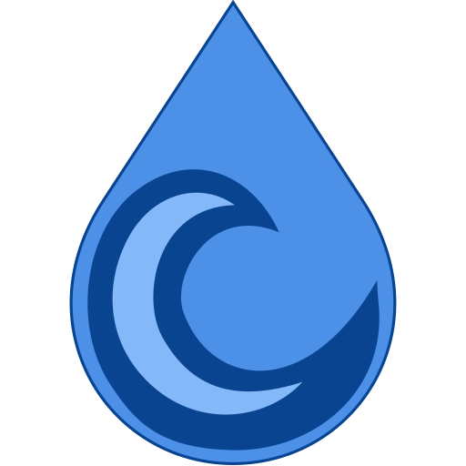

# n8n-nodes-deluge

Community node for **n8n** to interact with **Deluge**. It lets you automate
Deluge directly from your n8n workflows using a secure stored credential.

> ✅ **Verified community node** — installable directly from the n8n node panel
> (self-hosted **and** n8n Cloud).

## Installation

This is a **verified** community node: in n8n click **+ (Add node)**, search for
**Deluge**, and add it — no manual install needed.

Manual install (older n8n, or as an unverified package)

Go to **Settings → Community Nodes → Install** and enter `n8n-nodes-deluge`.

## Operations

| Operation | Description |
|---|---|
| **Add Magnet** | Add a torrent from a magnet link |
| **Get Config** | Get the configuration |
| **Get Filter Tree** | Get the filter tree |
| **Get Free Space** | Get the free disk space |
| **Get Libtorrent Version** | Get the libtorrent version |
| **Get Session State** | Get the session state |
| **Get Torrents** | Get many torrents |
| **Pause Session** | Pause the whole session |
| **Pause Torrent** | Pause a torrent |
| **Remove Torrent** | Remove a torrent |
| **Resume Session** | Resume the whole session |
| **Resume Torrent** | Resume a torrent |

## Authentication

This node uses the **Deluge API** credential. In n8n, go to **Credentials → New**, pick
**Deluge API**, and fill in:

- **Base URL** — the address of your instance, e.g. `http://deluge:8112` (no trailing slash).
- **Password** — your account password.

The node logs in with your username/password to obtain a session token, then reuses it automatically.

**Where to find it:** See the service documentation: https://deluge.readthedocs.io/en/latest/reference/web.html

The credential's **Test** button verifies the connection before you save.

## Usage

1. Add the **Deluge** node to a workflow (after a trigger such as *When clicking 'Test workflow'* or a Schedule Trigger).
2. Select your **Deluge API** credential.
3. Pick an **Operation** and run the workflow — the response is returned as JSON for the next node.

## Compatibility

Requires n8n **1.0** or newer. Built and linted with the official `@n8n/node-cli`, and
published to npm with a build-provenance attestation.

## Resources

- [Deluge](https://deluge.readthedocs.io/en/latest/reference/web.html)
- [n8n community nodes documentation](https://docs.n8n.io/integrations/community-nodes/)

## License

[MIT](./LICENSE)
